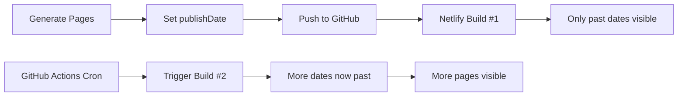

# Scheduled Publishing Configuration

## Overview

The site uses a two-part system for scheduled content publishing:

1. **Content Generation** (`config.yaml`) - Sets `publishDate` on pages
2. **Automated Builds** (GitHub Actions) - Triggers Netlify rebuilds to publish content

## How It Works



### Hugo Behavior

- **`buildFuture: false`** (production) - Hides pages with future `publishDate`
- **`buildFuture: true`** (development) - Shows all pages regardless of date
- Each Netlify build checks current time and publishes pages with past `publishDate`

## Configuration Files

### 1. Content Generation (`config.yaml`)

Controls **when pages should be published**:

```yaml
scheduling:
  start_timestamp: "2025-10-05T05:00:00+00:00"  # First page publish time
  publish_delay_minutes: 15                      # Interval between pages
  apply_to_articles: true                        # Enable for articles
  apply_to_products: true                        # Enable for products
```

**Example:** 10 articles with 15-minute intervals = published over 2.5 hours

### 2. Build Automation (`.github/workflows/scheduled-build.yml`)

Controls **how often Netlify rebuilds** to check for new publishable content:

```yaml
schedule:
  - cron: "*/30 * * * *"  # Every 30 minutes
```

**Common cron patterns:**
- `"*/30 * * * *"` - Every 30 minutes
- `"0 */1 * * *"` - Every hour
- `"0 6 * * *"` - Daily at 6 AM UTC
- `"0 0,12 * * *"` - Twice daily (midnight & noon)

## Coordination Guidelines

### Rule: Build Interval ≥ Publish Delay

For smooth rollout, GitHub Actions cron interval should be **equal to or greater than** `publish_delay_minutes`:

| publish_delay_minutes | Recommended Cron | Result |
|-----------------------|------------------|--------|
| 15 | `"*/30 * * * *"` | Multiple pages per build |
| 30 | `"*/30 * * * *"` | 1 page per build |
| 60 | `"0 */1 * * *"` | 1 page per build |
| Daily | `"0 6 * * *"` | All pages at once |

### Testing vs Production

**Testing (rapid rollout):**
```yaml
# config.yaml
publish_delay_minutes: 15

# .github/workflows/scheduled-build.yml
cron: "*/30 * * * *"
```

**Production (gradual rollout):**
```yaml
# config.yaml
publish_delay_minutes: 30

# .github/workflows/scheduled-build.yml
cron: "0 6 * * *"  # Daily
```

## Why Cron Can't Be in config.yaml

GitHub Actions reads workflow files (`.github/workflows/*.yml`) **before** any code runs. The cron schedule must be hardcoded in the workflow file because:

1. GitHub's scheduler needs to know when to run **before** checking out your code
2. Workflow files are parsed on GitHub's servers, not in your repository
3. Security: Prevents dynamic scheduling that could be exploited

## Manual Triggering

You can trigger a build manually without waiting for cron:

1. Go to: https://github.com/YOUR_USERNAME/auto-window-stickers/actions
2. Select **"Scheduled Netlify Build"** workflow
3. Click **"Run workflow"** → **"Run workflow"**

Or use the Netlify dashboard to trigger a deploy directly.

## Monitoring

- **GitHub Actions:** Check workflow runs and logs
- **Netlify:** Monitor deploy history and build logs
- **Site:** Verify new pages appear as expected

## Troubleshooting

### Pages not appearing after build

1. Check `publishDate` is in the past (UTC time)
2. Verify `buildFuture: false` in `hugo.yaml` for production
3. Check Netlify build logs for errors

### Too many/few pages per build

Adjust the ratio between `publish_delay_minutes` and cron interval.

### Builds not triggering

1. Verify `NETLIFY_BUILD_HOOK_URL` secret is set in GitHub
2. Check GitHub Actions workflow is enabled
3. Review GitHub Actions logs for errors
